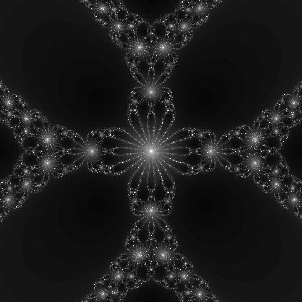
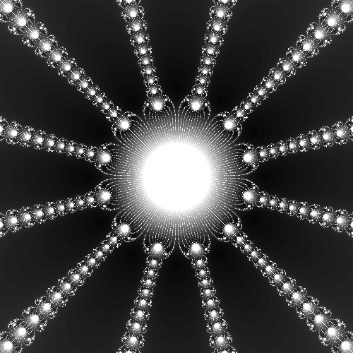
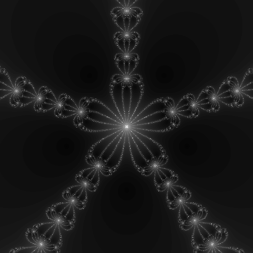
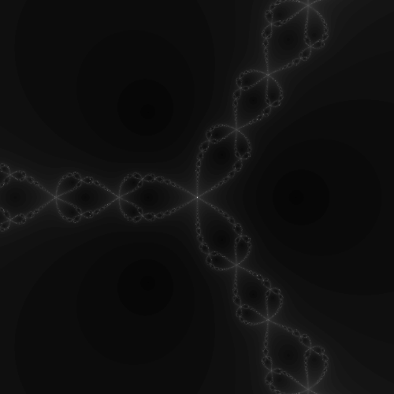
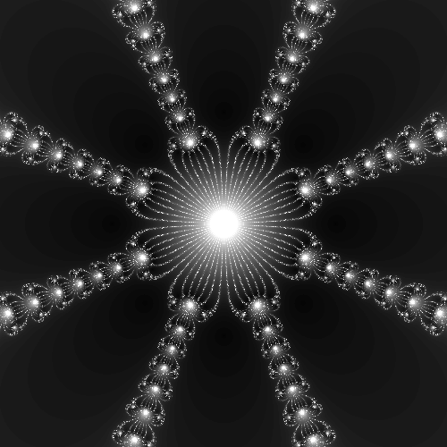
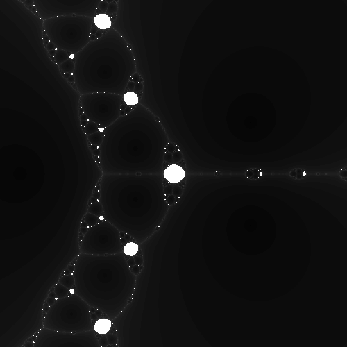

# Newton-Raphson-Fractals

Newton-Raphson fractals are captivating and visually stunning representations of complex polynomial equations. These fractals provide an artistic and mathematical glimpse into the intricate world of complex numbers and the roots of complex polynomials.

Newton fractal for $\ z^8-15z^4-16$, $\ z^{12} - 1$ and $\ z^5-1$

<p float="left">
   
   
    
</p>

Newton fractal for $\ z^3 - 1$, $\ z^8 - 1$ and $\ z^3-2z-2$

<p float="left">
   
   
    
</p>

## Key Features
- **Custom Polynomial Equations:** You can define your own complex polynomial equation, denoted as f(z), within the program. This equation is at the heart of the fractal generation process, allowing you to explore a wide range of mathematical expressions and artistic possibilities.

- **Automatic Derivative Calculation:** Define the derivative df(z) of your chosen polynomial equation f(z). This derivative is essential for applying the Newton-Raphson method and iteratively finding the roots.

- **Iterative Root Finding:** The program uses the Newton-Raphson method to iteratively refine guesses for the roots of your polynomial equation. It performs this process across a predefined range of complex numbers.

- **Image Rendering:** After each iteration, the software assigns colors to the pixels based on the roots found or the number of iterations required to converge to a root. The result is a visually stunning fractal image.

- **Output in .ppm Format:** The generated fractal images are saved in the popular .ppm format, which is compatible with various image viewing and editing software.

## Mathematical expressions
In the syntax of this program, mathematical expressions involving complex numbers are made intuitive and straightforward. You can represent the cubed power of a complex number z as z*z*z. To perform multiplication of a complex number z by a real number a, simply write Complex(a, 0) * z. For addition or subtraction of a real number a from a complex number z, you can express it as z + a or z - a, respectively. This syntax simplifies complex arithmetic, making it accessible and easy to work with when defining your polynomial equations.

### For Example
```js
Complex z(1, 1);
z * z * z represends z^3

Complex(12, 0) * z * z represends 12 * z^2

z*z*z*z - 1 represends z^4 - 1
```

## How to Use

Creating your own Newton-Raphson fractals is a straightforward process:

1. **Define Your Polynomial:** In the program, specify your complex polynomial equation `f(z)` as per your creative or mathematical goals.

3. **Automatic Derivative:** In the program, specify your complex polynomial derivative `df(z)` of your equation.

4. **Generate Fractal:** Run the program, and it will iterate through complex numbers, applying the Newton-Raphson method to find roots and assign colors to pixels.

5. **View and Share:** The resulting fractal image will be saved as `fractal.ppm`. You can view it with any image viewer or share it with others to showcase your artistic and mathematical exploration.

## Getting Started with make
To create captivating Newton-Raphson fractal images with this program, follow these simple steps to get started:

1. **Clone the Repository:** Begin by cloning this repository to your local machine using the following command:
```js
git clone https://github.com/raphsenn/newton-fractals.git
```
2. **Navigate to the Directory:** Move to the project directory by entering:
```js
cd Newton-Raphson-Fractals
```
3. **Define Your Polynomial:** Open the main.cpp file within the project directory. Here, you can define your complex polynomial equation f(z) and its derivative df(z) inside the provided functions Complex f(Complex z) and Complex df(Complex z). Customize these functions with your own polynomial expressions as desired.
```js
Complex f(Complex z) {
    return z * z * z - 1; // Define your complex polynomial here (represends z^3 - 1)
}

Complex df(Complex z) {
    return Complex(3, 0) * (z * z); // Define the derivative of your polynomial here (represends 3 * z^2)
}
```
4. **Save Your Changes:** Save the modifications you made to main.cpp.

5. **Build the Program:** Use the provided Makefile to build the program. Run the following command:
```js
make all
```

6. **Generate the Fractal:** Execute the program to generate the fractal image based on your custom polynomial equation:
```js
./main
```
7. **View and Share:** The generated fractal image will be saved as **fractal.ppm** in the project directory. You can open and view it with any image viewer software. Feel free to share your artistic and mathematical creations with others.

## Getting Started without make
To create captivating Newton-Raphson fractal images with this program, follow these simple steps to get started:

1. **Clone the Repository:** Begin by cloning this repository to your local machine using the following command:
```js
git clone https://github.com/raphsenn/newton-fractals.git
```
2. **Navigate to the Directory:** Move to the project directory by entering:
```js
cd Newton-Raphson-Fractals
```
3. **Define Your Polynomial:** Open the main.cpp file within the project directory. Here, you can define your complex polynomial equation f(z) and its derivative df(z) inside the provided functions Complex f(Complex z) and Complex df(Complex z). Customize these functions with your own polynomial expressions as desired.
```js
Complex f(Complex z) {
    return z * z * z - 1; // Define your complex polynomial here (represends z^3 - 1)
}

Complex df(Complex z) {
    return Complex(3, 0) * (z * z); // Define the derivative of your polynomial here (represends 3 * z^2)
}
```
4. **Save Your Changes:** Save the modifications you made to main.cpp.

5. **Build the Program:** Here's the order of commands to compile the main program without using make, assuming you have the source files complex.cpp, complex.h and main.cpp:
```js
g++ -c complex.cpp
g++ -c main.cpp
g++ complex.o main.o -o main
```

6. **Generate the Fractal:** Execute the program to generate the fractal image based on your custom polynomial equation:
```js
./main
```
7. **View and Share:** The generated fractal image will be saved as **fractal.ppm** in the project directory. You can open and view it with any image viewer software. Feel free to share your artistic and mathematical creations with others.

## Error solving
If you encounter an error message similar to the following:
```js
User
g++ -c complex.cpp
cc   main.o complex.o   -o main
/usr/bin/ld: complex.o: in function `abs(Complex)':
complex.cpp:(.text+0x7a4): undefined reference to `sqrt'
collect2: error: ld returned 1 exit status
```
To resolve this issue, you need to link the math library explicitly when compiling your program. You can do this by adding the -lm flag to your compile command, like this:
```js
g++ main.o complex.o -o main -lm
```

